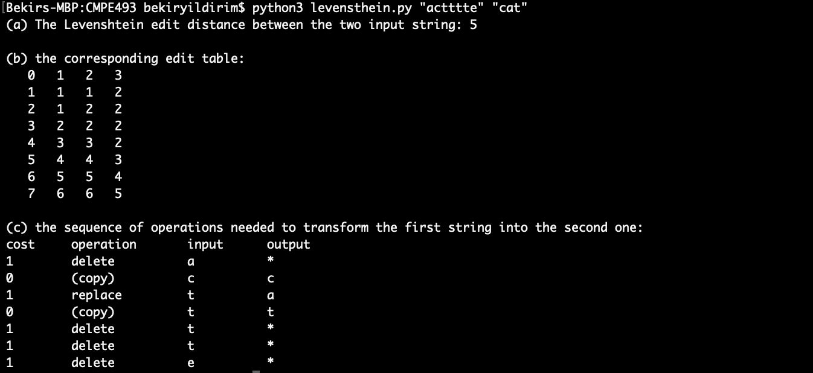
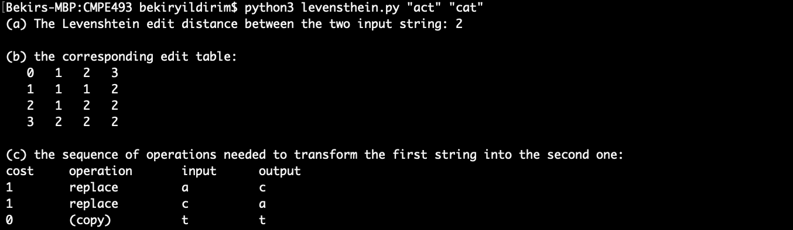
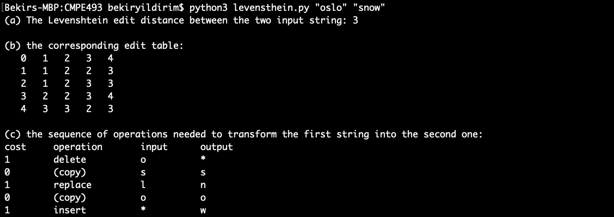
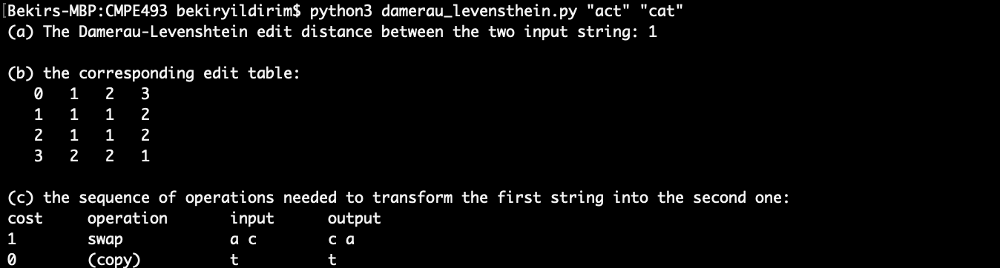
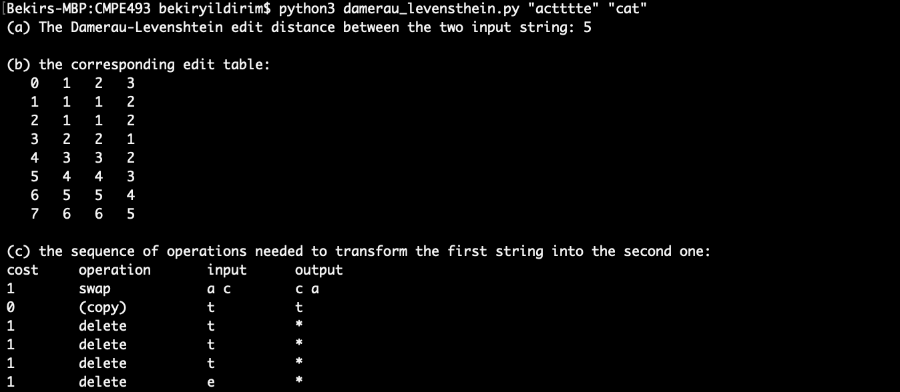
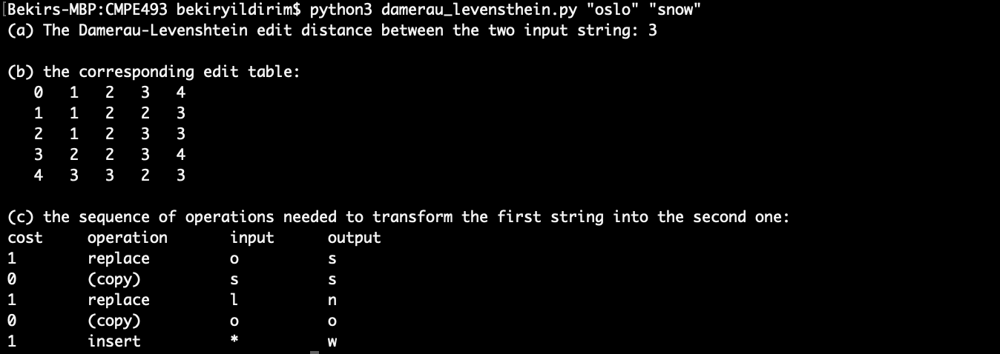

# CmpE 493 ASSIGNMENT 1

## LEVENSTHEIN AND DAMERAU-LEVENSTHEIN DISTANCE

### Usage

- for LEVENSTHEIN DISTANCE:  `$ python3 levensthein.py $arg0 $arg1`
- for DAMERAU-LEVENSTHEIN DISTANCE:  `$ python3 damerau_levensthein.py $arg0 $arg1`

### ScreenShots for LEVENSTHEIN DISTANCE:

#### LEVENSTHEIN DISTANCE

   
   
   
#### DAMERAU-LEVENSTHEIN DISTANCE

   
   
   

